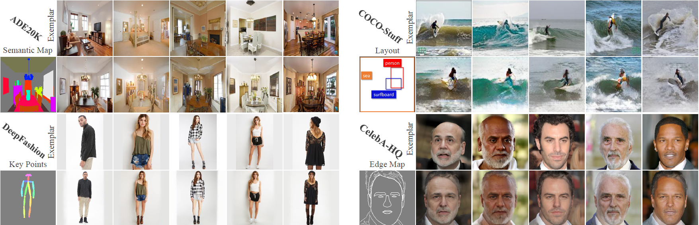

# Unbalanced Feature Transport for Exemplar-based Image Translation (CVPR 2021)


## Preparation
Clone the Synchronized-BatchNorm-PyTorch repository.
```
cd models/networks/
git clone https://github.com/vacancy/Synchronized-BatchNorm-PyTorch
cp -rf Synchronized-BatchNorm-PyTorch/sync_batchnorm .
cd ../../
```

**VGG model** for computing loss. Download from [here](https://drive.google.com/file/d/1fp7DAiXdf0Ay-jANb8f0RHYLTRyjNv4m/view?usp=sharing), move it to `models/`.

For the preparation of datasets, please refer to [CoCosNet](https://github.com/microsoft/CoCosNet).

## Pretrained Models
The pretrained models can be downloaded from [here](https://drive.google.com/file/d/1Z8B3fdU_suB8dJswR-QPwh-eZfkxSP7F/view?usp=sharing). Saving the pretrained models in `checkpoints`.

## Inference Using Pretrained Model
Then run the command 
````bash
bash test_ade.sh
````

## Training
Then run the command 
````bash
bash train_ade.sh
````

### Citation
If you use this code for your research, please cite our papers.
```
@inproceedings{zhan2021unite,
  title={Unbalanced Feature Transport for Exemplar-based Image Translation},
  author={Zhan, Fangneng and Yu, Yingchen and Cui, Kaiwen and Zhang, Gongjie and Lu, Shijian and Pan, Jianxiong and Zhang, Changgong and Ma, Feiying and Xie, Xuansong and Miao, Chunyan},
  booktitle={Proceedings of the IEEE/CVF Conference on Computer Vision and Pattern Recognition},
  pages={15028--15038},
  year={2021}
}
```

## Acknowledgments
This code borrows heavily from [CoCosNet](https://github.com/microsoft/CoCosNet). We also thank [SPADE](https://github.com/NVlabs/SPADE), [Synchronized Normalization](https://github.com/vacancy/Synchronized-BatchNorm-PyTorch) and [Geometric Loss](https://www.kernel-operations.io/geomloss/).
